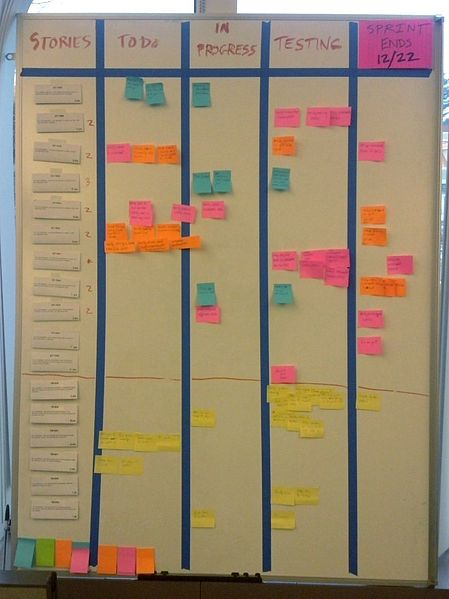

footer: Software project – Lecture 1
slidenumbers: true

# Software Project
### Lecture 1

## Wouter Swierstra

--------------------------------------------------------------------------------

# So you think you can program...

^ You have done Imperative programming and MSO

--------------------------------------------------------------------------------

# Intended learning outcomes

At the end of this course, you should be able to

- work in team

- interact with customers

- translate customer requirements to a working product

- plan and develop a software application

--------------------------------------------------------------------------------

# Theory & practice

- You have learned about the *theory* of software development in various courses you take;

- The software project gives you a valuable opportunity to put these ideas into practice.

These lectures try to bridge the gap by providing practical advice for your project.

--------------------------------------------------------------------------------

# What would you like to learn?

^ You've seen programming in IMP

^ You've seen design in MSO

^ What is left to learn? Where are your blind spots?

--------------------------------------------------------------------------------

# Topics covered

Different parts of software engineering:

* Software project management 

* Risk & architecture 

* Collaborative software development

--------------------------------------------------------------------------------

# Software project management (Scrum & Agile)

- How to organize a team of developers?

- How to plan development?

- Present your team structure, product backlog & risks.

--------------------------------------------------------------------------------

# Software Requirements & Architecture 

- How to identify risk?

- What is software architecture?

- How do risks and quality attributes influence my architecture?

- Present the key risks and software architecture of your project.

--------------------------------------------------------------------------------

# Software development

* How can to use version control effectively?

* How to deploy software automatically? Or script the build process?

* How to test complex software?

* What is test-driven development? Why is it important?

* Present your QA methodology.

--------------------------------------------------------------------------------

# The challenge in teaching this course

  

How to teach **principles** without being  vague?

How to teach **skills** without being project-specific?

--------------------------------------------------------------------------------

# Software project management

--------------------------------------------------------------------------------

# How do you organize and plan development in your hobby projects, practical exercises, or work?

^ You have already had to work on small software practical exercises.

^ Or perhaps you have a job as a software developer.

^ How well do you think this scales to 5 developers? What about 10?

--------------------------------------------------------------------------------

# The marshmallow challenge

--------------------------------------------------------------------------------

# Rules

Make a **freestanding structure** out of spaghetti, tape and string with the marshmallow on top.

* It cannot be attached to the ceiling or other higher objects. No holding the structure.

* I'll measure the distance from the table to the bottom of the marshmallow.

* Feel free to break the spaghetti, tape, or rope. The marshmallow must remain intact.

--------------------------------------------------------------------------------

# Rules

* You have 18 minutes.

* Team with the highest structure wins the rest of the bag of marshmallows.

* Any questions?

--------------------------------------------------------------------------------

# Reflection

^ The best team: what went well?

^ Worse teams: what went wrong?

^ How did you plan development?

^ If I asked you to do the challenge again what would you do differently?

--------------------------------------------------------------------------------

# [The Marshmallow Challenge](https://www.youtube.com/watch?v=H0_yKBitO8M)

--------------------------------------------------------------------------------

# Reflection

^ What did you learn?

^ How might you apply these ideas to your projects?

--------------------------------------------------------------------------------

# What I hope to teach

   

- The importance of **identifying risk**

- **Iteratively refine** a working prototype

- None of you are architects.

^ Any other thoughts?

--------------------------------------------------------------------------------

# Software project management

--------------------------------------------------------------------------------

# The software development process

The *software development process* is the set of activities that produce a piece of software:

- Requirements engineering & writing specifications;

- Analysis and design;

- Software validation and testing;

- Maintainance and evolution.

--------------------------------------------------------------------------------

# Software development methods

- A *software development method* is an organized way of constructing software – an 'algorithm' for software development

- *Idea:* documenting an approach will make success repeatable, projects (cost-)effective, and results predictable.

--------------------------------------------------------------------------------

# What software development methods have you heard of?

^ Waterfall, RUP, Agile/Scrum

--------------------------------------------------------------------------------

# Which have you actually used?

--------------------------------------------------------------------------------

# Knowing versus doing

Many of you may know the *theory* behind structured software development processes.

But almost none have applied these ideas well.

Delivering the right piece of working software on time is **hard**.

^ Vector Fabrics experience

--------------------------------------------------------------------------------

# Choices, choices, choices!

  

Wikipedia has a list of different [software development methods](http://en.wikipedia.org/wiki/Software_development_process)

Which is best for you?

--------------------------------------------------------------------------------

# What are the characteristics of these software/gametech projects?

--------------------------------------------------------------------------------

# The software project

* Limited resources: time, people, means.

* Equally experienced developers

* Committed customers; not many troublesome stakeholders

* Typically, no huge existing codebase.

--------------------------------------------------------------------------------

# Scrum

--------------------------------------------------------------------------------

# The Agile Manifesto (2001)

We are uncovering better ways of developing software by doing it and helping others do it. Through this work we have come to value:

* Individuals and interactions over processes and tools

* Working software over comprehensive documentation

* Customer collaboration over contract negotiation

* Responding to change over following a plan

--------------------------------------------------------------------------------

# What is Agile?

Agile software development refers to a collection of software development methods:

* Scrum

* Xtreme programming

* Kanban

* and many others

They are all the Agile methods.

--------------------------------------------------------------------------------

# Agile principles - I

* Customer satisfaction by rapid delivery of useful software

* Welcome changing requirements, even late in development

* Working software is delivered frequently (weeks rather than months)

* Face-to-face conversation is the best form of communication

--------------------------------------------------------------------------------

# Agile principles - II

* Working software is the principal measure of progress

* Continuous attention to technical excellence and good design

* Simplicity—the art of maximizing the amount of work not done—is essential

* Self-organizing teams

* Regular adaptation to changing circumstances

--------------------------------------------------------------------------------

# The Scrum Framework

- One popular approach organising an Agile development team.

- Developed by Jeff Sutherland in 1993.

- Given the time frame and type of project, Scrum might be a good option for you.

--------------------------------------------------------------------------------

# The Scrum team

There are three roles in the Scrum:

* The Product Owner

* The Scrum Master

* The Development team

* (Your UU Supervisor)

--------------------------------------------------------------------------------

# The Scrum process - I

* Together with the product owner, you will create a 'wishlist of features', called the *product backlog*

* The development team takes a small number of items from the top of the backlog: sprint backlog.

* These items are completed in a single *iteration* (2 weeks)

--------------------------------------------------------------------------------

# The Scrum process - II

* Daily meetings to assess progress

* At the end of the sprint, the stories should be completely implemented. There should be a shippable product increment ready.

* Every iteration a sprint review: how to improve the next sprint.

* Plan the next sprint and repeat.

--------------------------------------------------------------------------------

--------------------------------------------------------------------------------

# The Product Owner

The Product Owner is a single person representing all stakeholders:

- Helps prioritize the product backlog
- Responsible for product vision
- Prioritizes the Product Backlog
- Accepts or rejects product increments

--------------------------------------------------------------------------------

# The Scrum Master

The Scrum Master is responsible for making sure the process is smooth:

- remove outside distractions;
- chair review meetings or the daily standup;
- facilitates the process, without being a a project manager.

--------------------------------------------------------------------------------

# The Development Team

- That is YOU.
- No specific roles for testing, design, etc.
- You all share ownership of the code.
- You organize yourself – all outside influence goes through the Scrum Master and Product Owner.

--------------------------------------------------------------------------------

# Standup meetings - I

* Start each day with a stand-up meeting.

* The stand up meeting is at a fixed time and location, regardless of if people are missing.

* Pro-tip: set a repeating alarm on your cellphone.

* Everyone stands up – no sitting!

* The meeting is timeboxed: 20 minutes max.

--------------------------------------------------------------------------------

# Standup meetings - II

Everyone on the team says:

- What have I done yesterday?
- What problems am I facing?
- What am I going to do today?

Daily meetings help coordinate developer activity.

--------------------------------------------------------------------------------

# The task board

Or digitally using tools like [Trello](https://trello.com/)

--------------------------------------------------------------------------------

# The task board - I

* When planning the sprint, every developer is assigned stories.

* Each developer plans the implementation of this story, and splits this into small tasks.

* Each task goes on a post-it note.

--------------------------------------------------------------------------------

## Story: Setup a homepage for the team.

## What tasks can you identify?

--------------------------------------------------------------------------------

# Example tasks

- Create GitHub repository & add collaborators.
- Put content on bare HTML page.
- Add styling with a CSS file.
- Test across different browsers, operating systems, and devices.
- Publish links on social media.
- Upload to webserver.

--------------------------------------------------------------------------------

# The task board - II

* The tasks include testing, deployment, etc.

* All the post-it notes of all stories go on a single board, together
  with the original story description.

--------------------------------------------------------------------------------

# The task board - III

* All the stories and associated post-its are have their own row.

* The rows of the board are divided into several columns: todo, in
  progress, and done. (Other variations exist)

* Update the board during every standup meeting.

* At the end of the iteration, everything is done.

* The board is cleaned and a new iteration starts.

--------------------------------------------------------------------------------

# End of iteration

- Give a demo to the stakeholders at the end of the iteration.

- Clean the task board.

- Create new stories for any unfinished work.

--------------------------------------------------------------------------------

# Regular review

- End each iteration with a retrospective:

    * What went well?
    * What can we do better?

Start planning the next iteration after the demo. Your demo should help your customers and Product Owner decide what they want to see next.

--------------------------------------------------------------------------------

# Agile/Scrum pitfalls

* Don't add stories during the sprint.

* Don't solve problems during the standup.

* Lots of deadlines means lots of chances to write bad code to meet a deadline, introducing *technical debt*.

* You need a closely knit development team

* Prioritizing stories is hard.

* You are not experienced developers.

--------------------------------------------------------------------------------

# Teaching software development methods

**Listening** to me talk about Scrum is easy.

**Applying** the Agile philosophy is not.

In my experience, even smart people struggle to get this right.

Agile methods are still well-defined methods.

Being Agile is not an excuse for Cowboy Coding or lack of planning.

--------------------------------------------------------------------------------

# Beyond Scrum

There are a lot of other Agile methods:

* Agile Unified Process;

* Kanban

* Lean software development

* Scrum-ban

You may have experience working with methodology – use this!

--------------------------------------------------------------------------------

# More information

Lots of info available online:

* [http://www.scrumalliance.org](http://www.scrumalliance.org)

* [http://scrummethodology.com/](http://scrummethodology.com/)

* [http://www.mountaingoatsoftware.com/](http://www.mountaingoatsoftware.com/)

--------------------------------------------------------------------------------

# Learn more

Free Scrum training videos:

  [http://scrummethodology.com/](http://scrummethodology.com/)

Check out the reference card:

  [http://scrumreferencecard.com/scrum-reference-card/](http://scrumreferencecard.com/scrum-reference-card/)

--------------------------------------------------------------------------------

##Planning & methodology may not be the biggest technical challenge in your project; but it has a **huge impact** on the final results.

--------------------------------------------------------------------------------

# Scrum coaching

Friday February 13th, Max Verhorst (IT consultant and Scrum coach at
InfoSupport) will visit the University.

You will have an hour long session with him to present your project,
product backlog, and plans.

Please sign up for a slot!
