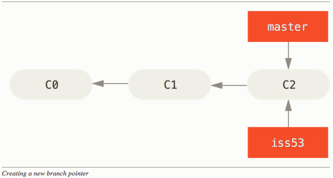
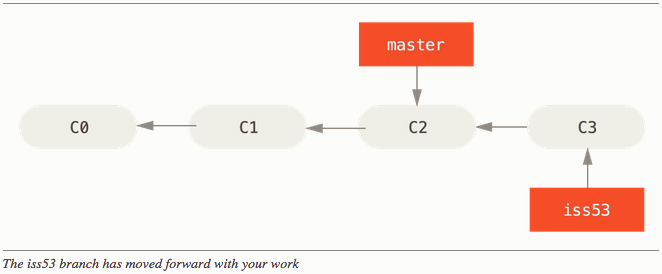
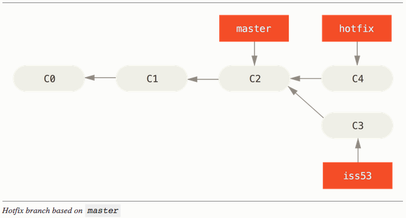
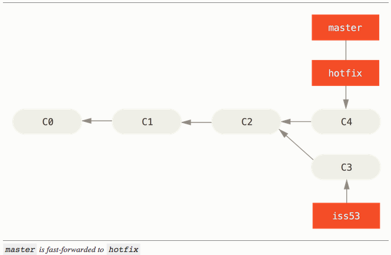

footer: Software project – Lecture 4
slidenumbers: true

# Software Project
### Lecture 4

### Wouter Swierstra

--------------------------------------------------------------------------------

# Last time

<br><br><br>

* Risks

* Software architecture

--------------------------------------------------------------------------------

## Working effectively with git and GitHub.

--------------------------------------------------------------------------------

# Collaborative software development

<br>

You have two weeks to finish your user stories.

And need to give a demo at the end.

## How can you develop different stories in parallel without breaking your working prototype?

--------------------------------------------------------------------------------

# Version control

--------------------------------------------------------------------------------

# What is git?

* A popular, powerful distributed file version control system
* It is free and obtainable from [git-scm.com](http://git-scm.com)
* Originally developed to manage the Linux kernel
* An estimated 27 percent of professional developers uses Git (May '12).

--------------------------------------------------------------------------------

# Getting to grips with git

* Git is a very powerful tool with many different features.

* The user interface takes some getting used to...

* When used correctly, it can be extremely effective.

* If you screw up, there is usually a way to undo your changes.

^ StackOverflow!

--------------------------------------------------------------------------------

# Starting a new repo

```
$ git init
Initialized empty Git repository in .git/
```

Add the README.md file to the repository

```
$ git add README.md
```

Commit the changes you made to README.md

```
$ git commit -m "Added README.md"
```

--------------------------------------------------------------------------------

# Cloning an existing repository

To get your hands on a copy of an existing repository use:

```
$ git clone git://github.com/wouter-swierstra/SoftwareProject
```

Note that `git clone` supports several different protocols, including SSH.

--------------------------------------------------------------------------------

# Git vs Svn

Git is a *distributed* version control system:

* a copy of a repository can share changes with any other copy.
* almost all commands operate on your *local copy*
* sharing changes with others happens in two steps:
    - commiting your changes locally
    - pushing these changes to a remote server

--------------------------------------------------------------------------------

# Git terminology


Picture from Scott Chacon's *Pro-Git*.

^ Untracked -- not in the repository

^ Unmodified -- tracked, but not modified

^ Modified -- tracked and modified

^ Staged -- modified and to be included in the next commit

--------------------------------------------------------------------------------

# Git status

```
$ git status
# On branch master
nothing to commit (working directory clean)

$ emacs 04-slides.md
$ git status

# On branch master
# Untracked files:
#   (use "git add <file>..." to include in what will be committed)
#
#   04-slides.md
```

^ So we need to add 04-slides.md

--------------------------------------------------------------------------------

# Adding new files

```
$ git add 04-slides.md
$ git status
# On branch master
# Changes to be committed:
#    (use "git reset HEAD <file>..." to unstage)
# 
#    new file: 04-slides.md
```

--------------------------------------------------------------------------------

# Staging modified files


Similarly, we can stage modified files using `git add`.

```
$ emacs README.md
$ git add README.md
# On branch master
# Changes to be committed:
#    (use "git reset HEAD <file>..." to unstage)
# 
#    new file: 04-slides.md
#    modified: README.md
```

Git gives you control over which files to include in a single commit.

--------------------------------------------------------------------------------

# Pro-tip: .gitignore to minimize noise

Generated binaries, documentation, and so forth are not under version control, but keep showing up when you run `git status`.

You can have a `.gitignore` file, listing the files, directories, and patterns that you want git to ignore:

```
$ cat .gitignore
*.pdf
.DS_Store
build/
```

--------------------------------------------------------------------------------

# Committing your changes

The `git commit` command commits all the staged changes.

```
$ git commit -m "Added 04-slides.md; updated README.md"
[master 76d15ab] Added 04-slides.md; updated README.md
 1 files changed, 1 insertions(+), 0 deletions(-)
 create mode 100644 04-slides.md
```

These changes are recorded *locally* but not yet shared with others.

--------------------------------------------------------------------------------

# Not mentioned

* `git mv` to rename files, without losing their history

* `git rm` to remove files from the repository

* `git commit -a` to record all your changes to tracked files

* `git log` to get an overview of recent changes

* `git reset` to undo changes

--------------------------------------------------------------------------------

# Sharing your changes

All these commands operate on your local copy of the repository.

Nothing is shared with others yet.

* `git pull` – pulls in changes from some other repository
* `git push` – pushes your changes to another repository

These commands communicate with *remote repositories*.

--------------------------------------------------------------------------------

# Basic usage: git push

```
$ git clone git://github.com/wouter-swierstra/SoftwareProject
...
$ emacs 04-slides.md
$ git commit -am "Updated slides on git"
...
$ git push
Counting objects: 9, done.
Delta compression using up to 2 threads.
Compressing objects: 100% (5/5), done.
Writing objects: 100% (5/5), 3.37 KiB, done.
Total 5 (delta 4), reused 0 (delta 0)
To git@github.com:wouter-swierstra/SoftwareProject.git
   6040584..9b40f60  master -> master
```

Git's user interface can be a bit noisy...

--------------------------------------------------------------------------------

# Basic usage: git pull

```
$ git pull
remote: Counting objects: 15, done.
remote: Compressing objects: 100% (15/15), done.
remote: Total 15 (delta 4), reused 1 (delta 0)
Unpacking objects: 100% (15/15), done.
From github.com:wouter-swierstra/SoftwareProject
   6abc078..08fac51  master     -> origin/master
Updating 6abc078..08fac51
```

This pulls in any new changes from the remote repository

--------------------------------------------------------------------------------

# Showing remote repositories

```
$ git clone git://github.com/wouter-swierstra/SoftwareProject
...
$ git remote -v
origin	git://github.com/wouter-swierstra/SoftwareProject (push)
origin	git://github.com/wouter-swierstra/SoftwareProject (fetch)
```

You can add new remote branches using

```
git remote add remoteName git://github.com/user/repository.git
```

Feel free to choose your own meaningful `remoteName`

--------------------------------------------------------------------------------

# Recap

This covers the basic interactions necessary to mimic subversion.

Git makes it *very easy* to work on different versions of your software.

You can create new branches, switch between branches, or merge branches quickly and easily.

Using branches effectively can drastically improve collaborative development.

--------------------------------------------------------------------------------

# Branching

In git, a *branch* is effectively a pointer to some repository state.

You can add new changes to any specific branch, which may cause development lines to diverge.

Branches may be *merged*, aggregating changes made in different development lines.

--------------------------------------------------------------------------------


--------------------------------------------------------------------------------

# Creating and switching branches

```
$ git branch iss53
$ git branch
  iss53
* master
$ git checkout iss53
$ git branch
* iss53
  master
```
--------------------------------------------------------------------------------



--------------------------------------------------------------------------------

# Diverging branches

If I'm in the `iss53` branch, I can make changes *without effecting the master branch*.

```
$ emacs README.md
$ git commit -am "Working on #53"
```
--------------------------------------------------------------------------------




--------------------------------------------------------------------------------

# Even more branches

```
$ git checkout master
$ git branch hotfix
$ git checkout hotfix
$ emacs README.md
$ git commit -am "Hotfix in README.md"
```

--------------------------------------------------------------------------------



How to get the changes to the `hotfix` branch back into `master`?

--------------------------------------------------------------------------------

# Git merge

```
$ git checkout master
$ git merge hotfix
Updating f42c576..3a0874c
Fast-forward
 README.md | 2 ++
 1 file changed, 2 insertions(+)
```

--------------------------------------------------------------------------------



From this point on, continue development in the `iss53` branch until it is ready to be merged with the master branch.

--------------------------------------------------------------------------------

# Not covered

* Using `git branch -d` to delete branches

* Working with remote branches

* How `git pull` uses branches under the hood.

* More advanced branching commands

--------------------------------------------------------------------------------


# The real challenge

<br>

This covers the very basic `git` operations.

You can now collaborate on a single codebase.

But collaborating *effectively* is not easy.

--------------------------------------------------------------------------------

# Golden rules

1. The master branch may only contain code that is tested, reviewed and ready to be released.

1. Only commit code that compiles, even in experimental branches.

1. New user stories start in a fresh branch; no such branch lives more than three iterations, before being merged.

1. Create pull requests for every new branch. Only merge your changes if everyone is happy, the code is tested and reviewed.

--------------------------------------------------------------------------------

# 1 – The master branch is ready for release

The master branch serves a single purpose:

## it represents the current stable version of development

If I walk into your office at any point in time, you should be able to demo the master branch.

The code should be so good, that you'd be happy to release it, even if it lacks functionality.

--------------------------------------------------------------------------------

# 2 – Only commit code that compiles


^ Breaking the build blocks all other developers.

^ Shame on you!

--------------------------------------------------------------------------------

# 2 – Only commit code that compiles

Breaking the build is the cardinal sin of collaborative development.

This blocks the entire development team, until you fix the issue.

Compile and run your regression tests before committing – don't make other people clean up your mess.

--------------------------------------------------------------------------------

# 3 – New stories start in a new branch

The master branch is the stable development release.

Unfinished features are *never* developed on the master branch directly.

Instead, every iteration starts with several new branches.

Once new features are tested, reviewed and ready, they can be merged back into master.

--------------------------------------------------------------------------------

# 4 – Create pull requests

In principle, you can manage branches from the commandline.

If you choose to host your code on GitHub you have some additional features that can help collaboration:

* Issue tracker (which can be used for your product backlog)

* Wiki for tracking documentation, discussions, or meeting notes.

* GUI for creating and merging branches

* Pull request = Code + Issue + Discussion

--------------------------------------------------------------------------------

# Github Demo

^ Create branch

^ Create pull request

^ Discuss pull requests

--------------------------------------------------------------------------------

# Golden rules

1. The master branch may only contain code that is tested, reviewed and ready to be released.

1. Only commit code that compiles, even in experimental branches.

1. New user stories start in a fresh branch; no such branch lives more than three iterations, before being merged.

1. Create pull requests for every new branch. Only merge your changes if everyone is happy, the code is tested and reviewed.

--------------------------------------------------------------------------------

# Using GitHub

Feel free to use GitHub, provided:

* your client is happy for you to do so;

* a copy of the repository is hosted on the UU servers (for instance, as an additional remote).

There are plenty of alternatives:

* BitBucket

* GitLab

--------------------------------------------------------------------------------

# Best practices

* Use `git tag` to tag the version of the repository at the end of every sprint or upon delivering a milestone.

* Write meaningful commit messages – use "#x" to refer to issue numbers in the GitHub issue tracker.

* Check your changes regularly using `git diff` and `git status`

* Use `git log` to review recent commits

* Caveat: don't commit to the wrong branch! Use separate directories if necessary.

--------------------------------------------------------------------------------

# Further reading

* Scott Chacon's [Pro-git](http://git-scm.com/book/en/v2)

* [Atlassian git tutorials](https://www.atlassian.com/git/)

* [Pull request video tutorial](https://vimeo.com/41045197)

* [Most common git screwups](http://41j.com/blog/2015/02/common-git-screwupsquestions-solutions/)
